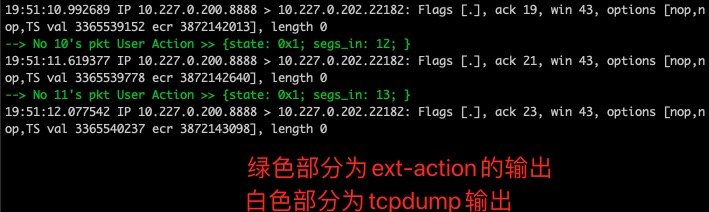
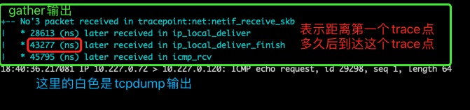

# netcap

## 简介

netcap(内部称为xcap)是一个基于bcc，可对含skb作为参数的系统函数，或者基于DPDK的mbuf抓包分析的工具。简单试用如下：

```shell
netcap skb -f icmp_rcv@1 -e "host 10.227.0.72" -i eth0
```

## 安装依赖

netcap工具依赖安装`bcc`包。


## 命令行参数说明

可以通过netcap的help获取用法资料以及example如下:

```shell
# 查看 skb 模式支持的参数
netcap help skb
# 查看 mbuf 模式支持的参数
netcap help mbuf
```

本质上，命令行参数分为以下3类:

* skb模式与mbuf模式通用的
* 仅skb模式的
* 仅mbuf/raw模式的

### 通用命令行参数

* -f  function_name<@param1><@param2>

  设置需要trace的函数格式, function_name表示要trace的函数名称，并可支持多点抓包，用逗号分隔，例如 `ip_local_deliver@1,icmp_rcv@1`。

  对于skb模式，支持:

  * -f tracepoint:net:netif_receive_skb  是tracepoint的方式，此时无需param1和param2。
  * -f icmp_rcv@1  是kprbe的方式，需要param1，表示skb是被trace函数的第几个参数（从1开始），无需param2。
  * -f tcp_rcv_established@2@1 这里@2表示第2个参数是skb，后面的@1是ext扩展参数,关于此参数详见 --ext-action 描述。

  对于mbuf模式, 由于DPDK会使用mbuf数组，故使用param2的时候表示是mbuf数组，仅仅使用param1的时候是mbuf：

  * -f usdt:rx_one@1  是usdt的方式的，并且rx_one的usdt第一个参数param1是mbuf指针。
  * -f usdt:rx_array@1@2  是usdt的方式的，并且rx_array的usdt第一个参数param1是mbuf指针的数组，第二个参数param2是前面说的数组的大小。
  * -f func@1  是uprobe的trace,此处表示mbuf。
  * -f func_array@1@2  是uprobe的trace，此处表示mbuf数组。

  Note: -f 参数较为复杂，可以结合后面的Example理解。

* -e  expression

  设置需要过滤数据包的表达式，此表达式基于tcpdump的语法。

* -t  tcpdump-flags

  设置tcpdump的flags, 例如想以 -nnve 的tcpdump方式查看数据包，即可输入 -t "-nnve"。

* -w  file

  --write-file-rotate  rotate-num 

  抓包写文件，同tcpdump，通过 --write-file-rotate 指定的 rotate-num  表示循环抓包，即抓最后的rotate-num个包，写入pcap文件。

* -c  capture-count

  抓多少个包后退出，设置为0或不设置表示不限制次数，同tcpdump。

* --capture-max-size  max

  这个size是指抓的包，保存到buff的大小，如果包长超过这个值，则包会被截断。

* --gather

  汇总输出用法，此参数为开关参数，打开此开关忽略 -w 参数。

  gather功能仅在多点trace下使用，并以第一个被trace的点为基准值，跟踪数据包到达后续trace点的延迟信息。

  gather功能它持有的子参数如下：

  * --gather-buffer-size  size : 设置buff的大小。
  * --gather-timeout  timeout : 超时时间。
  * --gather-distinguish-by-pointer : 以指针(skb或mbuf)来标识同一个数据包，否则以包内容。
  * --gather-output-color : 设置打印gather的颜色: red|green|yellow|blue|purple|cyan。

  此功能较为复杂，可参照Example理解。

* --ext-filter  filename.c

  用户自定义filter，[只看TCP的FIN包的自定义filter例子](doc/example/ext_filter/skb_filter_tcp_fin.c)
  ```shell
  netcap skb -f tcp_drop@2 -e 'port 8888' -t "-nnv"  --ext-filter skb_filter_tcp_fin.c
  ```

* --ext-action  filename.c

  用户自定义的匹配后的action，在action中netcap会把user填充的自定义的结构体的信息与pkt一起输出到控制台。[输出sock信息的例子](doc/example/ext_action/sk_stat_action.c)
  ```shell
  # 其中 tcp_rcv_established @2表示第2个参数为skb, @1表示第1个参数sk作为ext传入到 --ext-action指定的函数
  netcap skb -f tcp_rcv_established@2@1 -e "port 8888"  --ext-action sk_stat_action.c
  ```
  输出如下图所示：
  
  * --ext-output-color : 设置打印user Ouput的颜色: red|green|yellow|blue|purple|cyan。

* --dry-run

  并不真正执行,只是打印出生成的ebpf代码。

### skb模式的参数

* -i  interface

  例如 -i eth0, 同tcpdump

* --fake-hdr

  在某些TX方向函数(例如 __ip_finish_output)，内核还没有给它填充eth,ip等头信息,使用此选项可以由netcap根据skb的sock信息伪造出header来适配tcpdump过滤语法。
  
* --skb-data

  不设置此参数表示使用 netcap 的默认策略来寻找packet开始地址，若设置此标志，则使用 skb->data + offset 作为数据包的开始。其中的offset由 --skb-data-offset 设置。需要设置此参数的场景：某些特殊的函数行为，导致默认策略找到的地址错误。
  
* -S

  开关参数，设置后，伴随pcap打印此包对应的kstack，并忽略 --gather 和 -w 参数。
  
  * --stack-dump-color : 设置打印kstack的颜色: red|green|yellow|blue|purple|cyan。

### mbuf/raw模式的参数
  注：mbuf用于DPDK开发，raw用于AFXDP开发。
  注：usdt受限于上游库修改，用兴趣的可以自行魔改。

* -p  pid

  设置要trace的DPDK程序的pid。

## Examle

### skb的常规用法

```shell
# 在icmp_rcv抓包，并指定eth0为收包网卡，并按tcpdump语法过滤
netcap skb -f icmp_rcv@1 -e "host 10.227.0.72" -i eth0 -t "-nnv"

# 把抓到的包写入文件icmp.pcap
netcap skb -f icmp_rcv@1 -e "host 10.227.0.72" -i eth0 -w icmp.pcap

# 打印kstack
netcap skb -f icmp_rcv@1 -e "host 10.227.0.72" -i eth0 -S

# 在tracepoint抓包，注意:tracepoint不需要使用@传递skb是第几个参数
netcap skb -f tracepoint:net:netif_receive_skb@1 -i eth0 -e "host 10.227.0.72"
```

### mbuf的常规用法

```shell
# 在pid为1111的DPDK进程中，对于you_func函数(uprobe)抓包，其中mbuf指针作为此函数的第一个参数
netcap mbuf -f you_func@1 -e "tcp and port 80" -t "-nnve" --pid 1111

# 在pid为1111的DPDK进程中，对于对于you_func函数函数(uprobe)抓包，其中vec_func传递的是mbuf指针数组,故需2个参数
netcap mbuf -f vec_func@1@2 -e "tcp and port 80" -t "-nnve" --pid 1111

# 在多个函数同时抓包
netcap mbuf -f func_rcv@1,func_send@1 -e "tcp" --pid 111
```

### gather用法

gather只能针对trace多个函数（即 -f 后面要用多个函数），并把第一个作为基准。举例如下：

```shell
# 使用gather统计以下函数，并用cyan的颜色输出信息
netcap skb -f tracepoint:net:netif_receive_skb,ip_local_deliver@1,ip_local_deliver_finish@3,icmp_rcv@1 -e "host 10.227.0.72 and icmp" -i eth0  --gather --gather-output-color cyan 
```


